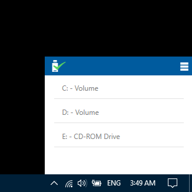

# Hot Eject
## Overview
Hot Eject is a Utility software that allows user to assign hotkeys (e.g Ctrl + Alt + Z) for use in safely ejecting USB drives. It was inspired by the majority of windows users I see clicking on Ctrl + Alt in an attempt to safely eject a USB (that doesn't work out-of-the-box people, use this) . This is me trying to help.

## Screenshots

## System Requirements (running Hot Eject)
 - Windows Vista or higher.
 - [.NET 4.5](http://www.microsoft.com/en-au/download/details.aspx?id=30653)
 
  ## Features
 - Assign hot key for ejection of all drive or a single drive (Ctrl + Alt + Z by default).
 - Configurable hot key to show options panel (Ctrl + Alt + O by default).
 - Change user preferences
 - Localization (Only english and yoruba at the moment)
 
 ## Todos
 - Show locking process when file in USB is being used.
 - Confgure autorun app on devices added or removed (handy for backup and sync tools)
 - Add command line support
 - Reconnect a device without removing and re-adding
 - Think of more todos.
 
 
 ## Libraries and Integrated code:

* [Caliburn.micro](https://caliburnmicro.com/)
* [NotifyIcon WPF](https://bitbucket.org/hardcodet/notifyicon-wpf/src)
* [Apache log4net™](https://logging.apache.org/log4net/)
* [Eject USB disks using C#](https://www.codeproject.com/Articles/13530/Eject-USB-disks-using-C)

## Reusable Librarie(s) (Part of Hot Eject):

* [HotEject.Core](https://github.com/yemikudaisi/hot-eject/tree/master/src/HotEject.Core)
* [HotEject.Core.Input](https://github.com/yemikudaisi/hot-eject/tree/master/src/HotEject.Core.Input)

## Hot Eject Contributors

* [Yemi Kudaisi](https://github.com/yemikudaisi/) (Project Founder)

###### Copyright 2018 Yemi Kudaisi for the Hot Eject. Hot Eject is distributed under the MIT license.
